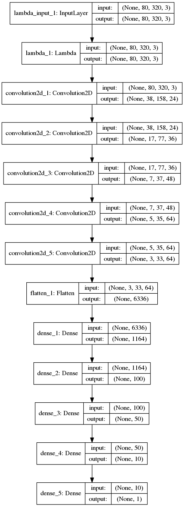
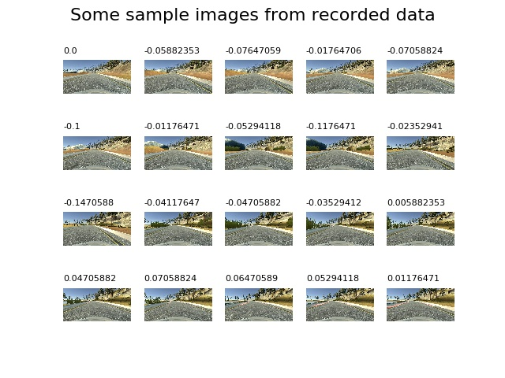
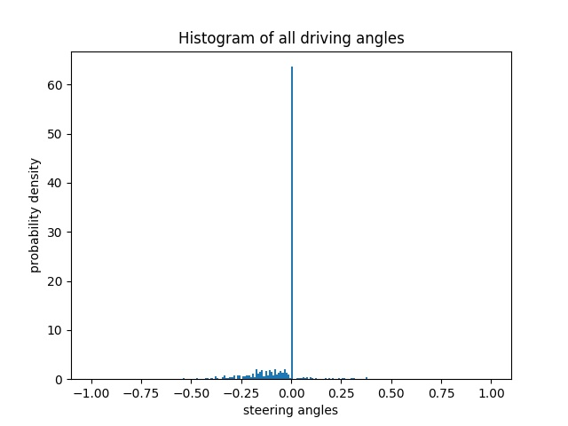
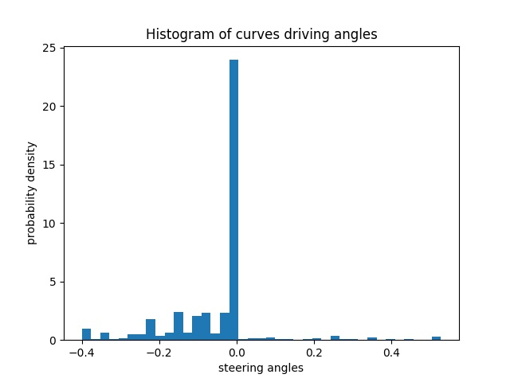
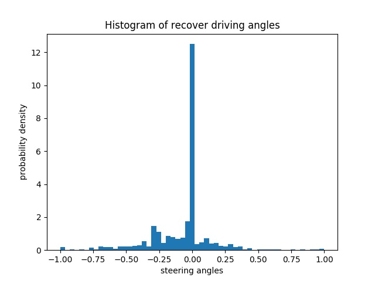
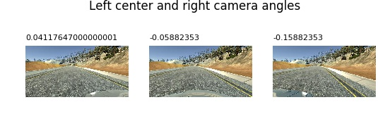
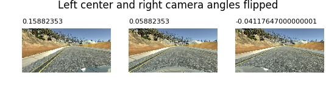
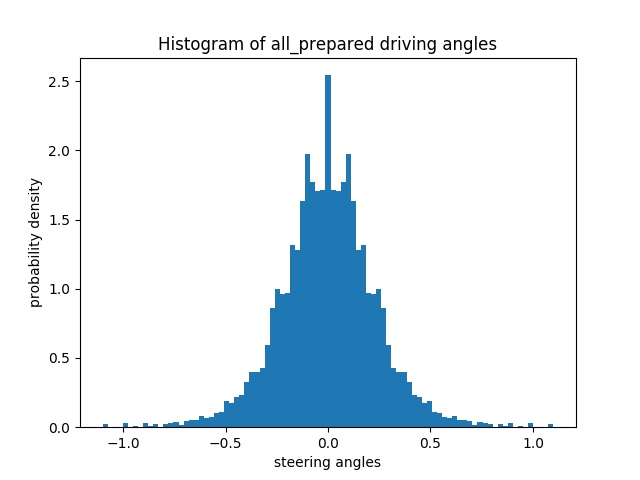
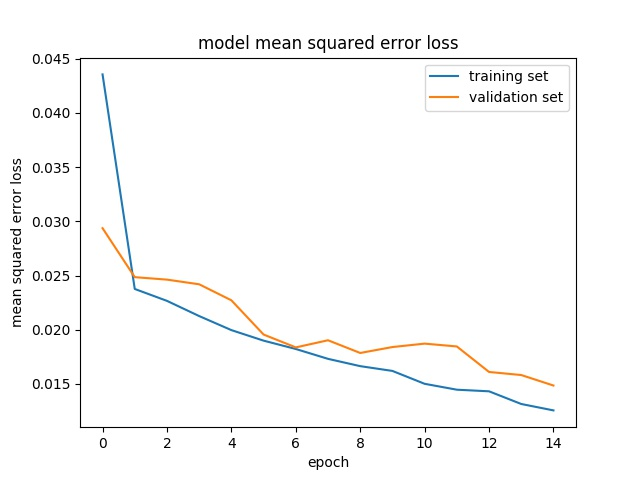

**Behavioral Cloning Project**

The goals / steps of this project are the following:
* Use the simulator to collect data of good driving behavior
* Build, a convolution neural network in Keras that predicts steering angles from images
* Train and validate the model with a training and validation set
* Test that the model successfully drives around track one without leaving the road
* Summarize the results with a written report

---
### Files Submitted

#### Overview of files and can be used to run the simulator in autonomous mode

My project includes the following files:
* model.py containing the script to create and train the model
* drive.py for driving the car in autonomous mode
* model.h5 containing a trained convolution neural network 
* writeup_report.md (README.md) summarizing the results

#### Functional code

It turnes out that depending on the performance of the machine it can happen that the same model behaves bad on same track.
This also already happening when trying to record screen.

Nevertheless recorded run shows the successful driving of the trained model:


Using simulator and drive.py the car can be driven in autonomous mode by:
```sh
python drive.py model.h5
```

### Model Architecture and Training Strategy

#### Solution Design Approach

The architecture is choosen based on [NVIDIA](http://images.nvidia.com/content/tegra/automotive/images/2016/solutions/pdf/end-to-end-dl-using-px.pdf) due to well known working state.
The main focus was basically to provide the CNN the best possible input to fulfill the challenge and not to overfit it or underfit it.
As it turns out this is actually the challenging part overall.
Not to overfit the network data was balanced and dropout layers were used and enough data was created not to underfit the network see following sections.

The main goal is to train the network to reduce the mean square error between the original steering angle and the steering angle from simulation.

#### Final Model Architecture



The network starts with an cropping layer removing 60 pixels from top and 20 from bottom followed by lambda layer and 5 convolution 2D layer with first three having 2x2 stride and last two with 1x1 stride.
Finally network is flattened and finalized with three fully connected layers with one steering angle output at the end.

The network was setup with keras which has a nice highlevel abstraction and definition for different types of layers and makes it basically plug and play of setting up a model.

#### Creation of the Training Set & Training Process

Data was collected with beta simulation which provides center, left and right image. 

The recorded behavior includes:
- three rounds staying as far as possible on center
- some data to recover when driving off center
- and some additional focusing mainly on smooth curve driving

Sample images from recorded data:


First analysis histogram has indicated that driving straight is the most likely case and specifically to track 1 the track has more left turns.



A histogram including only curve drives:



The recovering data shows better balance:



For better balance additional data were augmented by flipping image and adjusting left and right image steering angle by 0.1.



Flipped:



Furthermore the data of angle 0.0 was sampled only each 15th time.

Final data of all recorded data with augmented data and adjustment:



To focus mainly on the road the image was trimmed including only bottom road part.

Only 15 epochs have been used and the data set was split to 70% training and 30% validation. See image below for executed training.

The result of training loss over epochs:



The training set and validation set helped to determine over or under fitting. 
Low mean square error on training set and high on validation set would indicate overfitting and vice versa underfitting. 
The training loss shows that the network is not over or underfitted.

### Pitfalls

This model is not generalized good enough to catch up with the other tracks. This is open todo on the list improving the overall model.

