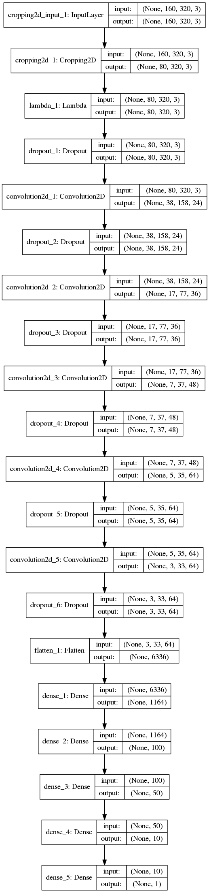

# Intro

Udacity project to teach recorded behavior and predict steering angles based on collected data from a simulation.

# Goal

Predicting steering angle from a center image and keep car on the road.

# Data collection

Data was collected with beta simulation which provides center, left and right image. 

The recorded behavior includes:
- three rounds staying as far as possible on center
- some data to recover when driving off center
- and some additional focusing mainly on smooth curve driving

# Architecture

The architecture is choosen based on [NVIDIA](http://images.nvidia.com/content/tegra/automotive/images/2016/solutions/pdf/end-to-end-dl-using-px.pdf) due to well known working state.
The main focus was basically to provide the CNN the best possible input to fulfill the challenge and not to overfit it or underfit it.
As it turns out this is actually the challenging part overall.

The main goal is to train the network to reduce the mean square error between the original steering angle and the steering angle from simulation.

## CNN

The network starts with an lambda layer and is followed by 5 convolution 2D layer with first three having 2x2 stride and last two with 1x1 stride.
Finally network is flattened and finalized with three fully connected layers with one steering angle output at the end.

The network was setup with keras which has a nice highlevel abstraction and definition for different types of layers and makes it basically plug and play of setting up a model.

# Training

The model was trained on a laptop with NVIDIA Quadro K2000M. Unfortunately the simulator was crashing on this machine.
Therefore to get quicker feedback and feeling of the predicted angles a check_predictions.py script has been used to just show based on first images the possible result.

The model was trained with an generator and additional data were augmented by flipping image and adjusting left and right image steering angle by 0.1.
To focus mainly on the road the image was trimmed including only bottom road part.

Only 5 epochs have been used and the data set was split to 70% training and 30% validation. See image below for executed training.

# Autonomous driving

It turnes out that depending on the performance of the machine it can happen that the same model behaves bad on same track.
This also already happening when trying to record screen.

Nevertheless the video  and  shows the successful driving of the trained model.

# Pitfalls

This model is not generalized good enough to catch up with the other tracks. This is open todo on the list improving the overall model.

